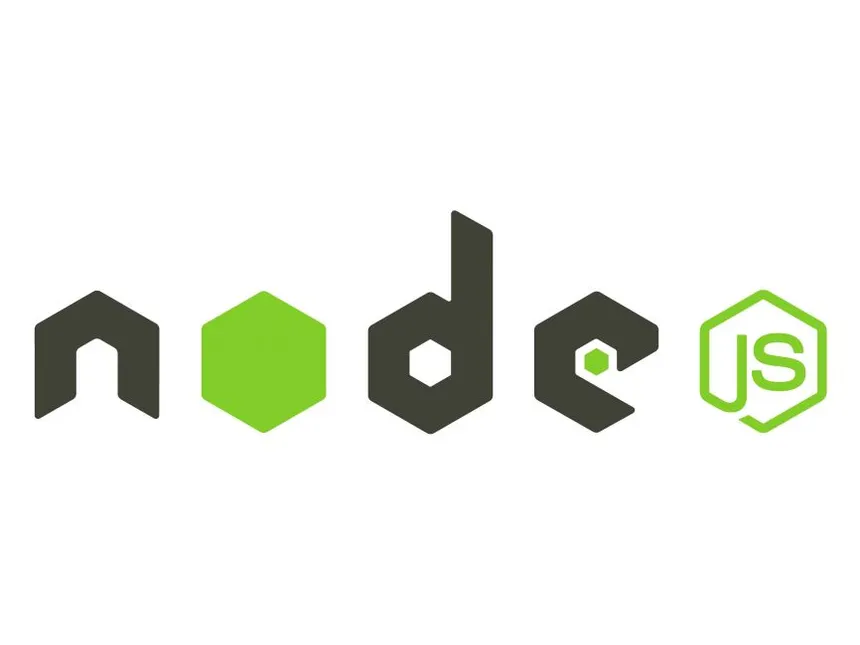
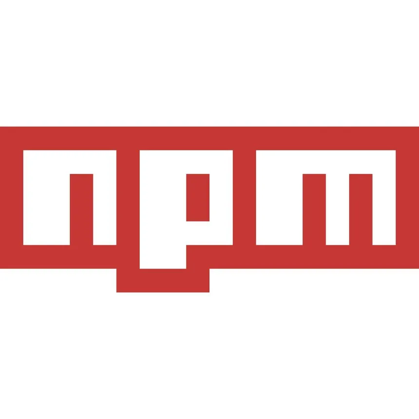
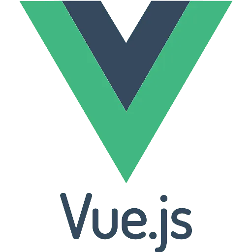

README du TP
- guide d'installation 
- quelques explications rapides

---
# 🛠️ Environnement de développement

Ce projet est composé de trois parties principales :

- Front-end : **Vue 3 + Vite + TypeScript**
- Back-end : **Node.js + Express + Sequelize**
- Base de données : **MySQL, orchestrée avec Docker**

Le fichier .env est fourni pour le développement/test, il n’y a donc rien à configurer de ce côté-là.

---
# 📦 Outils requis (à installer sur la machine)
## 1. Node.js

Version recommandée : >= 18 (compatible avec Vite 7 et Node latest en Docker)

Vérification :
```bash
node -v
npm -v
```

👉 Installation : https://nodejs.org/

## 2. Docker & Docker Compose

Utilisés pour :

- MySQL
- phpMyAdmin
- API backend node

Vérification :

```bash
docker --version
docker compose version
```

👉 Installation :

Docker Desktop (Windows / macOS) : https://www.docker.com/products/docker-desktop/

---
# 📁 Structure du projet
```ruby
.
├── front-end/          # Vue 3 + Vite
├── back-end/           # API Node.js / Express
├── docker-compose.yml
├── Dockerfile
├── .env                # fourni pour le dev

```

---
# ⚙️ Installation des dépendances

## Front-end
```
cd front-end
npm install
```

### Principales dépendances :

- vue 3
- vue-router
- pinia
- axios
- vite
- typescript
- vue-tsc

## Back-end (hors Docker) => non necessaire
```bash
cd back-end
npm install
```

### Principales dépendances :

- express (v5)
- sequelize
- mysql2
- jsonwebtoken
- bcryptjs
- dotenv
- moment
- nodemon (dev)


---
# 🐳 Lancement du back avec Docker

Depuis la racine du projet :

```bash
cd back-end
docker compose up 
```

Services exposés :

| Service     | URL / Port                     |
| ----------- | ------------------------------ |
| API Node.js | `http://localhost:${APP_PORT}` |
| MySQL       | `localhost:${DB_PORT}`         |
| phpMyAdmin  | `http://localhost:8081`        |

👉 phpMyAdmin :
- Host : db
- User / Password : depuis .env

---
# ▶️ Lancement du front (hors Docker)

## Front-end
```bash
cd front-end
npm run dev
```

Accès par défaut :

http://localhost:5173

---

# 🧰 Outils utilisés côté Front-end
## Node.js



Node.js est l’environnement d’exécution JavaScript utilisé hors navigateur.

Dans ce projet, il sert principalement à :

- exécuter le serveur de développement Vite
- installer et gérer les dépendances du projet
- lancer les scripts (npm run dev, npm install, etc.)

👉 Node.js est indispensable pour travailler avec Vue, Vite et TypeScript.

---

## npm (Node Package Manager)



**npm** est le gestionnaire de paquets fourni avec Node.js.

Il permet de :

- télécharger les bibliothèques (Vue, Pinia, Axios, etc.)
- gérer les versions des dépendances
- lancer des scripts définis dans le **package.json**

Exemples :

```bash
npm install
npm run dev
```

---

## TypeScript


TypeScript est un sur-ensemble de JavaScript qui ajoute le typage statique.

Avantages :

- détection d’erreurs à la compilation
- meilleure lisibilité du code
- auto-complétion plus efficace dans l’IDE
- code plus robuste et maintenable

Dans ce projet :

- tous les fichiers front sont écrits en TypeScript
- **vue-tsc** est utilisé pour vérifier les types dans les composants Vue

---

## Vue 3



Vue.js est un framework JavaScript pour construire des interfaces utilisateur.

Vue 3 apporte :

- la Composition API (setup, ref, computed, etc.)
  - Reactivité
  - Evolutif
- de meilleures performances
- une intégration native avec TypeScript

Dans l’application :

- Vue gère l’affichage et les composants
- vue-router gère la navigation
- pinia gère l’état global (store)

---

## Vite


Vite est l’outil de build et de serveur de développement du projet.

Il remplace des outils plus anciens comme Webpack et offre :

- un démarrage quasi instantané
- le hot reload (rechargement automatique à chaque modification)
- une configuration simple 
- un excellent support de TypeScript et Vue 3

Vite est utilisé pour :

- lancer le front en développement (npm run dev)
- construire l’application pour la production
